# July 2026 UX round — what changed, with screenshots

This round closed a review of the builder and integration surfaces: two bugs
and ten UX/feature gaps, each verified by dedicated Playwright e2e specs
(`qa/e2e/v3-*.spec.ts`), the full package suite, and the Postgres parity job
(migration `0005`).

## 1. Public form renders questions in authored order (bug)

`runtimeSteps` used to re-partition steps (contact fields last — a pilot
inheritance), so a form authored with a name step first rendered it last
publicly. The authored `config.steps` array order is now the single source of
truth; `flowGroup` only affects scoring.

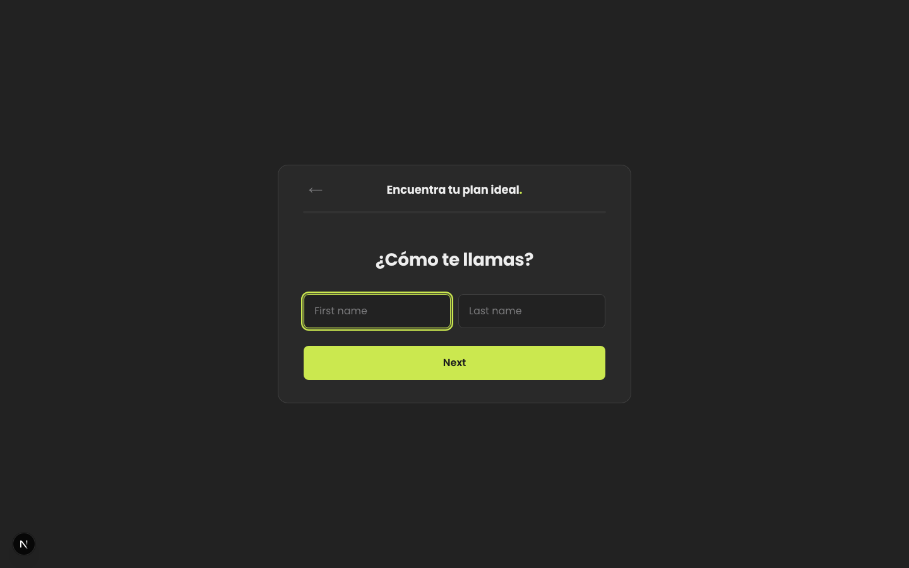

## 2. Type `@` to insert a previous answer (recall)

The question title (and dynamic-question variants) open a filterable picker on
`@` / `[` listing only fields captured **before** that step; selecting inserts
`[field]`. Referencing a later or unknown field shows an inline warning.

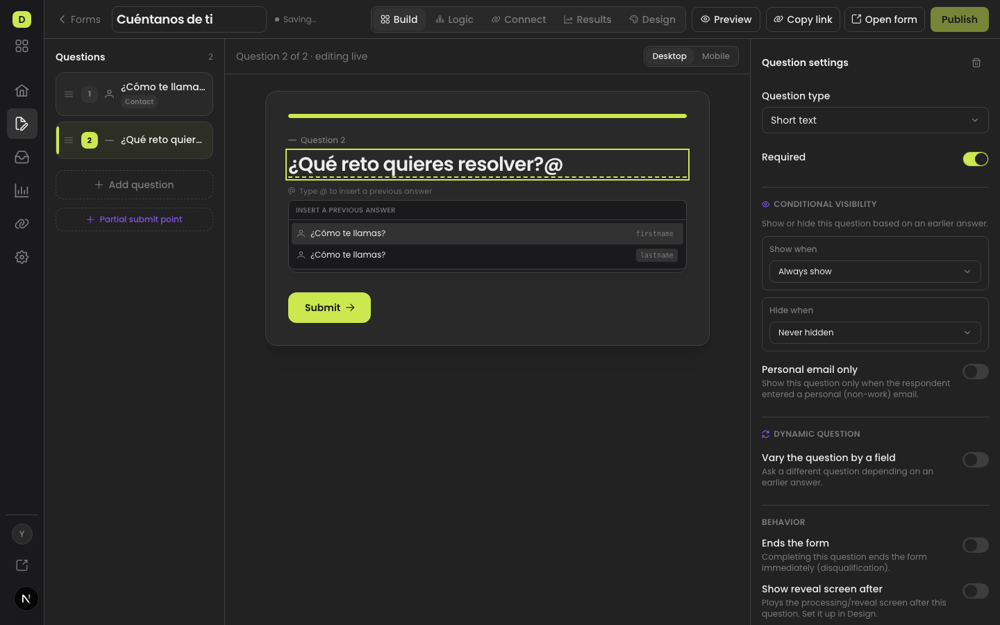

## 3. Forms list: first-class actions

Grid cards became action rows — Edit, Submissions, Analytics and Connect are
visible, with copy-link/open icon buttons; the kebab keeps only Duplicate and
Delete.

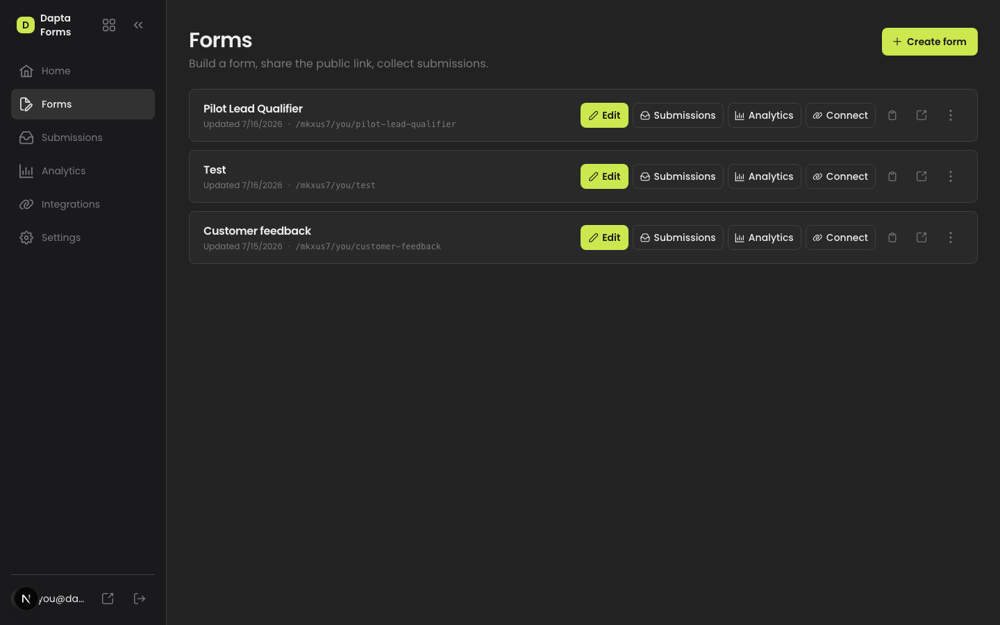

## 4. Connect tab in the editor

Build · Logic · **Connect** · Results · Design. Connect hosts the per-form
HubSpot integration, webhooks (partial/complete events), tracking pixels and
email templates, deep-linkable via `?tab=connect` (the old
`/admin/forms/:id/integrations` route redirects).

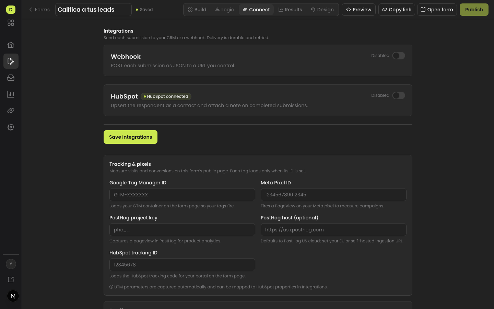

## 5. Branded confirmations

A reusable `ConfirmDialog` (alertdialog, focus trap, destructive variant)
replaced all six native `window.confirm` dialogs.

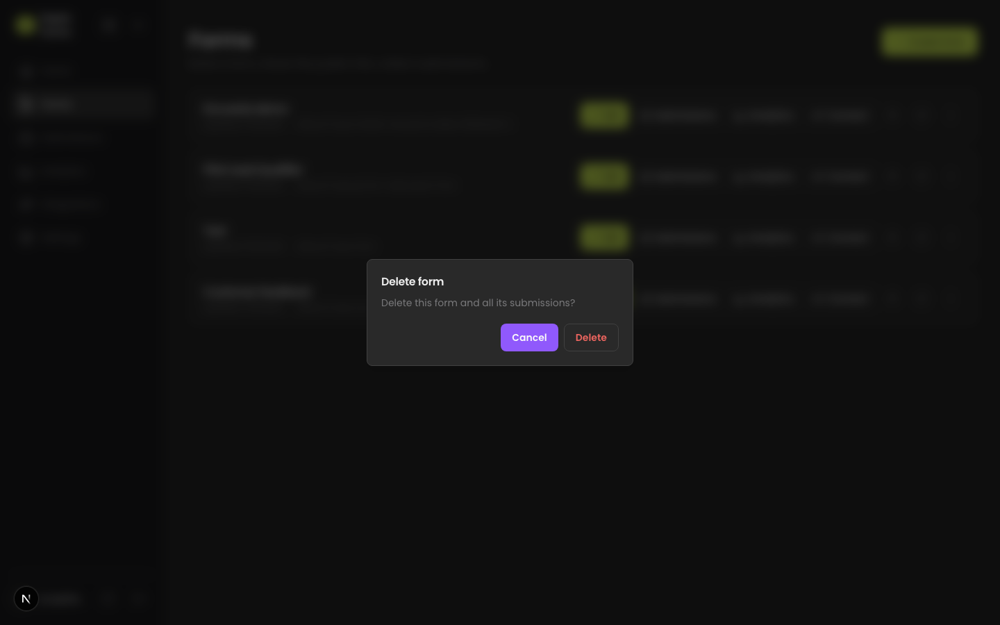

## 6. Guided HubSpot mapping

Custom mapping and value-map keys are grouped searchable dropdowns (form
questions / auto-captured UTM system fields / custom escape hatch), and value
maps are framed as answer→CRM translation with a concrete example.

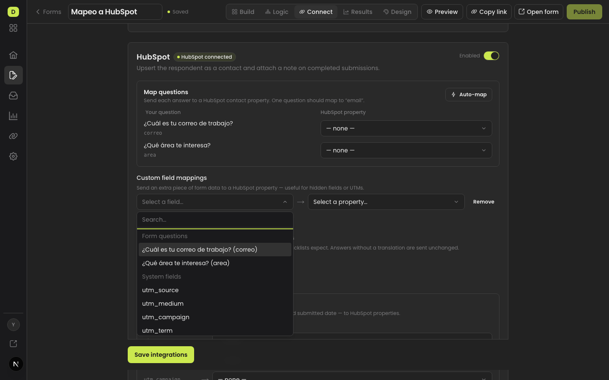

## 7. Per-question "Map to"

Selecting a question in Build shows a HubSpot section in the settings panel —
the same live `fieldMappings` the Connect tab edits.

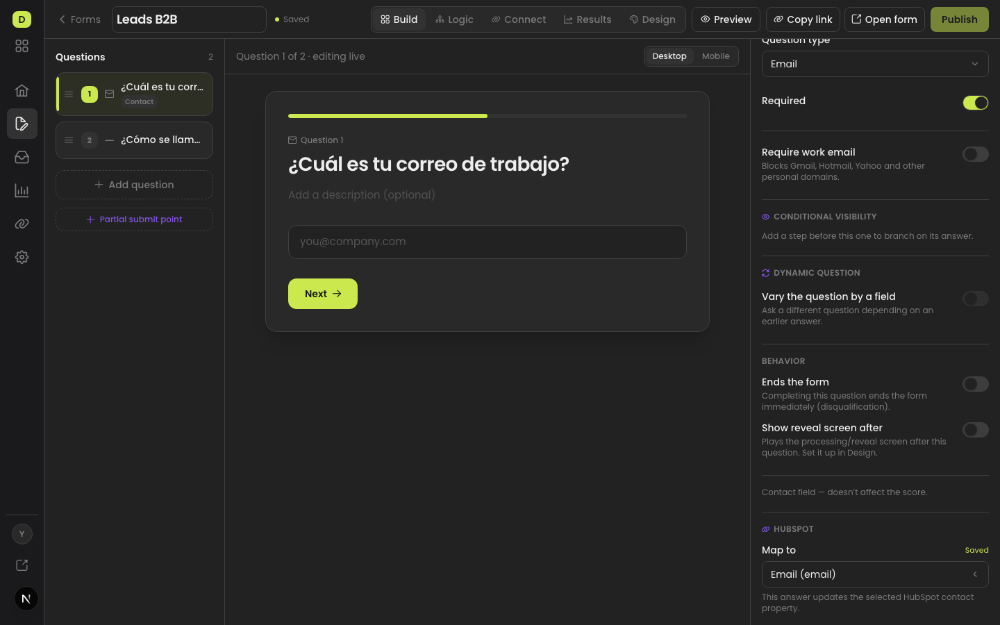

## 8. Partial submit point in the question list

The `partialSubmitAfterStep` threshold is now a draggable marker between
questions (with an explanatory popover), instead of a select buried in Design.
Mechanics unchanged: one submission row gets `partial_at` when the respondent
passes the point and the same row is upgraded with `completed_at` on finish.

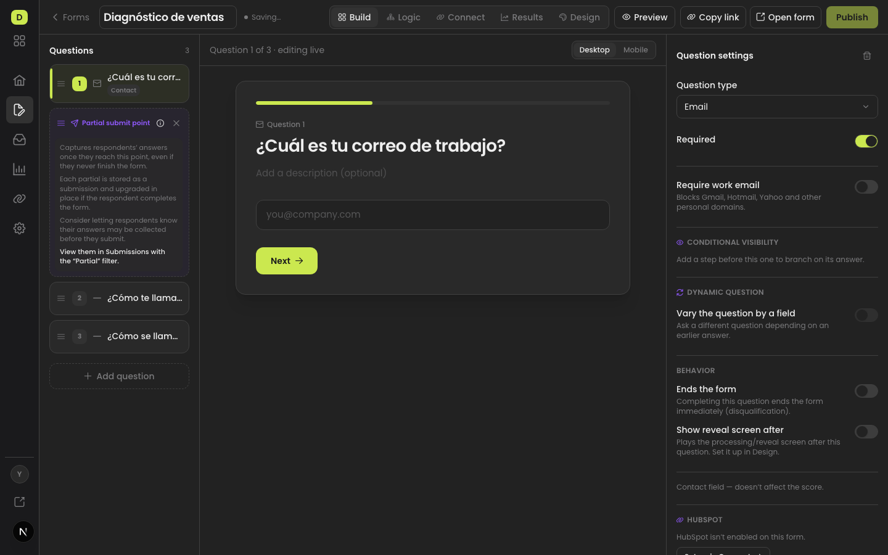

## 9. Tracking & pixels UI

`formConfig.tracking` (GTM, Meta Pixel, PostHog, HubSpot) finally has an admin
surface, with per-field examples; UTM parameters keep being captured
automatically on every submission.

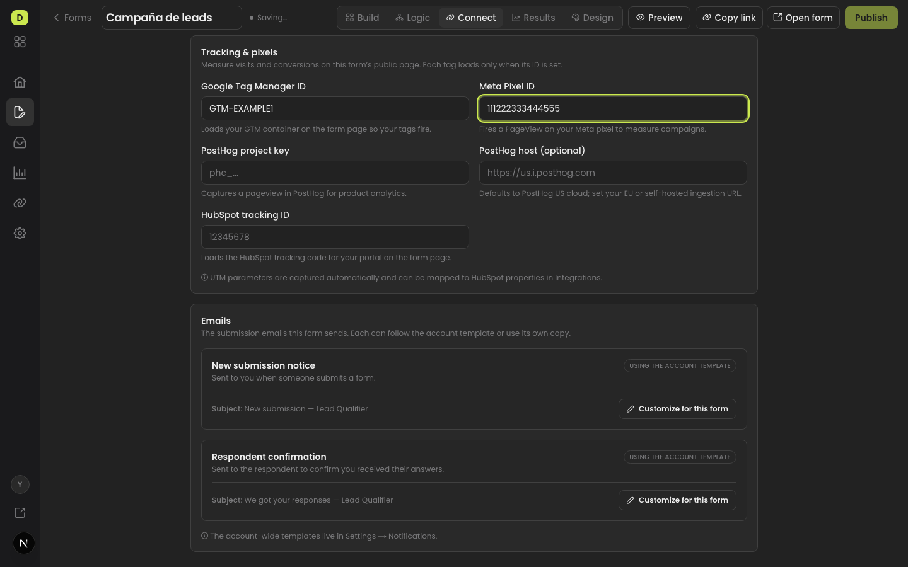

## 10. Banner pinned to the top

The cover banner now stays at the top of the viewport in every phase and
viewport; only the content centers below it.

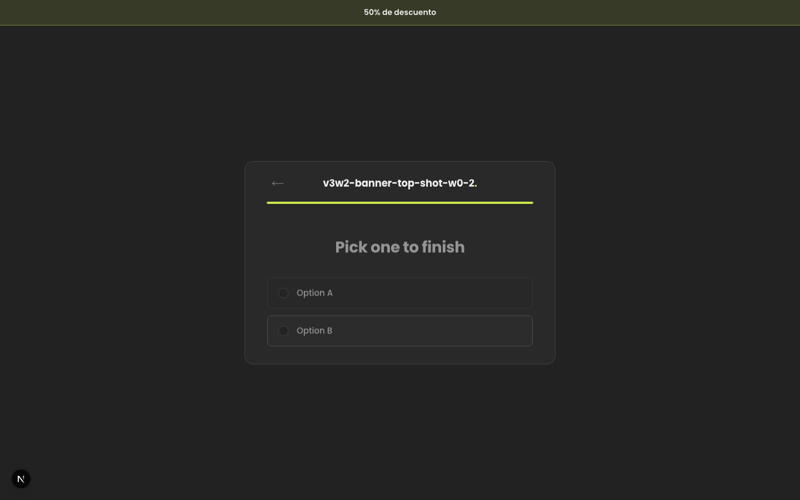

## 11. Per-form email templates

`notification_setting` gained a nullable `form_id` (migration `0005`, both
dialects). Resolution merges **form → account → stock** per field; the Connect
tab's Emails section customizes subject/body/enabled per form with `{{token}}`
chips and live preview, and Settings keeps the account-wide base.

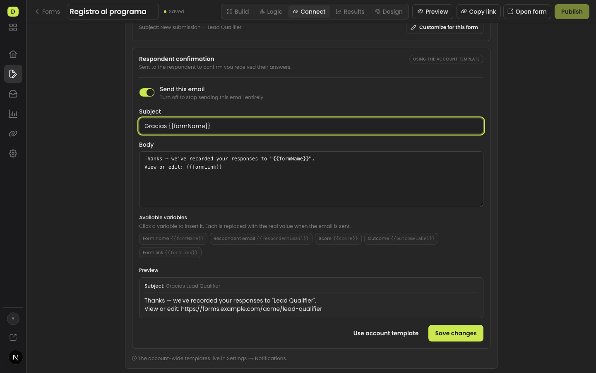

## 12. Name step placeholder defaults + live preview

Empty placeholders publish with localized defaults ("First name / Last name",
es: "Nombre / Apellidos"), and the editor canvas live-previews the configured
values instead of a hardcoded mock.

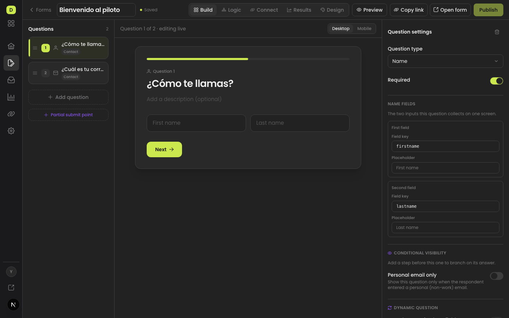
